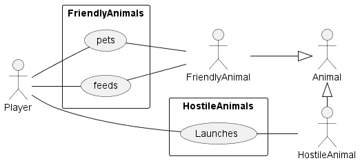
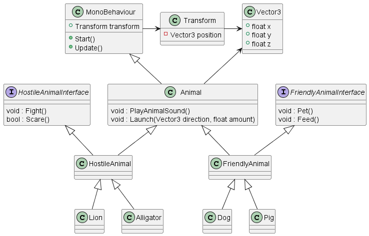

# Software Requirement Specification

## Methods

### User storie(s)

User stories is a way to communicate expectations in regard to requirements of the program

 * The player choses to launch a hostile animal, like a lion, in any direction 
 * The player catches the launched animal
 * The animals can run off if the are left alone for too long
 * The friendly animals can be fed
 * The friendly animals can be petted
 * The player ...

### Actors

If we go through the user stories, we can identify some actors which helps better define our project and start the design process

 * Player
 * Hostile animal launcher
 * Animals
 * Hostile animal
 * Friendly animal

### Usecases

Another way of increasing the quality of your requirement specification is to include a use case diagram

### MuSCoW prioritization
 
 * Must, means that this requirement must be fulfilled! Without the "must" features, the program doesn't make sense for the user of the program.
 * Should, means that this requirement will be next in line, when all the 'musts' are done. The program isnt really ussuable without the "shoulds".
 * Could, means that the requirement/feature is still being thoughtover, and due to uncertainty it is placed as a "could"
 * Want, is the wishfull thinking and for potential later direction with the project

## MuSCoW prioritization

 * The player must be able choose between different hostile animals to launch
 * The player must be able to launch a hostile animal with a variable amount of force in a 3-dimensional direction
 * The animals must not suffer any harm!
 * The player should be able catch the animal after launch
 * The player could be able to relaunch again to move around on a map
 * The player wants to use the launched animal as target practice

## 

# Design

# Requirements, design and implementation

Based on earlier lessons and assignment you should by now have most of the above design already implemented. I have created an example chapter regarding requirements that could lead to the design you have implemented os far.

Your job now is to change the requirements, design and implementation to better match your idea! After this assignment we will look into Unity, were we can add some graphics to the logic of the program. 

