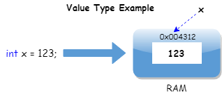

- [My notes](#my-notes)
  - [Variables](#variables)
  - [Data types, built-ins, int, string, float, bool](#data-types-built-ins-int-string-float-bool)
  - [Operators; +, -, /, *, %, ++, --, +=](#operators-----------)
  - [Boolean logic, if, else, switch, and, or](#boolean-logic-if-else-switch-and-or)
  - [Arrays and lists](#arrays-and-lists)
  - [Loops](#loops)
    - [Break/Continue](#breakcontinue)
  - [Methods](#methods)
    - [Return](#return)
    - [Parameters/Arguments](#parametersarguments)
  - [Classes and OOP](#classes-and-oop)
    - [Scope](#scope)
    - [Static](#static)
    - [Constructors](#constructors)
    - [Objects](#objects)
    - [Fields](#fields)
    - [Inheritance](#inheritance)
      - [Abstract](#abstract)
      - [Protected](#protected)
      - [Virtual](#virtual)
    - [Interfaces](#interfaces)
  - [Enums](#enums)
  - [Exceptions](#exceptions)
- [Git](#git)
- [References](#references)

# My notes

## Variables

Variable betyder ting der varierer.
Variabler skal have en data-type for at computeren kan finde ud af hvor meget plads den skal reservere (RAM).
Navnet paa variablen fungerer som en addresse i computerens hukommelse (RAM)
Man behoever ikke give dem en vaerdi til at starte med, men pas paa med NULL

```cs
string ThisIsAStringVariableWithAvalue = "This is the string variables value";
string ThisIsAlsoAString;
```

Addresser i hukommelsen benytter ofte hexidecimal (16-tals system)




## Data types, built-ins, int, string, float, bool

## Operators; +, -, /, *, %, ++, --, +=

## Boolean logic, if, else, switch, and, or

## Arrays and lists

## Loops

### Break/Continue

## Methods

### Return

### Parameters/Arguments

## Classes and OOP

### Scope

### Static

### Constructors

### Objects

### Fields

### Inheritance

#### Abstract

#### Protected

#### Virtual

### Interfaces

## Enums

## Exceptions

# Git

# References

https://www.w3schools.com/cs/index.php

https://www.youtube.com/c/Brackeys/playlists (C# playliste 8 afsnit af ca. 15 minutter)

https://dotnet.microsoft.com/en-us/learn/csharp